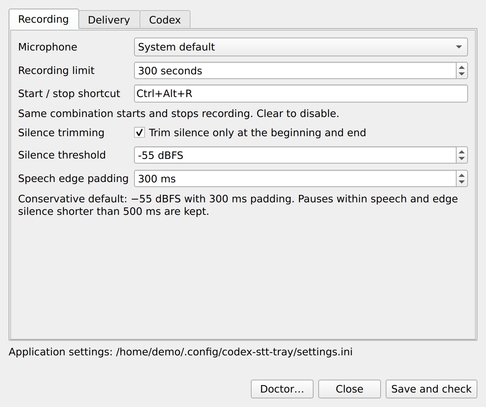
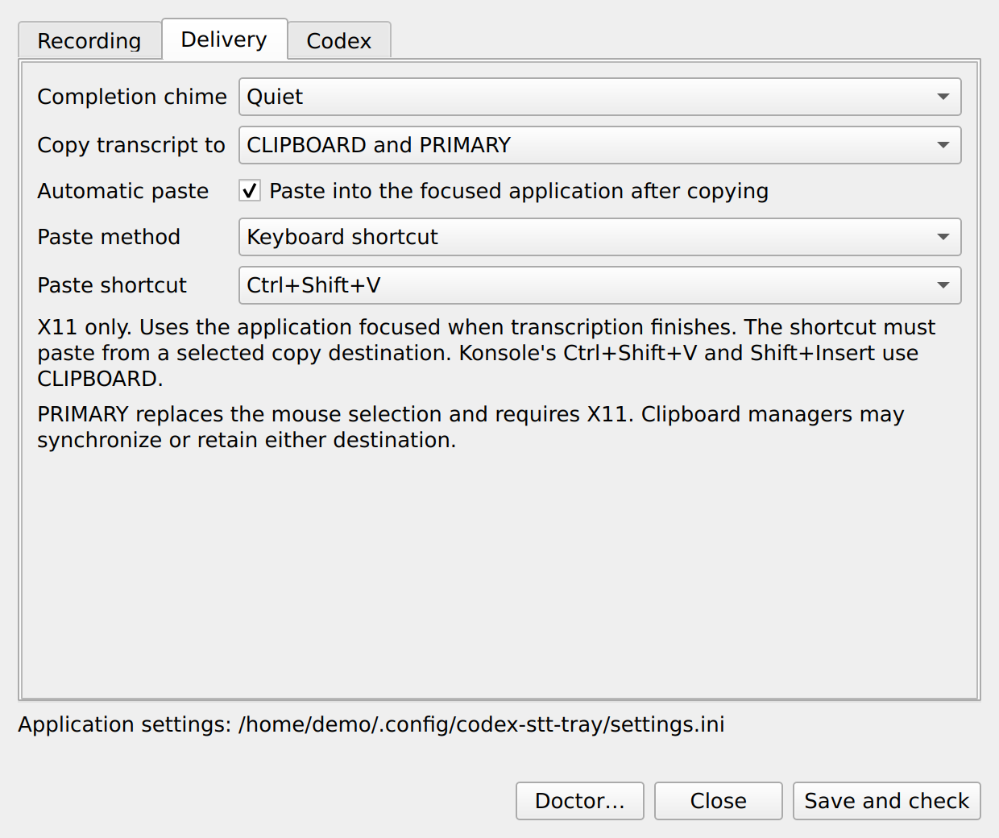
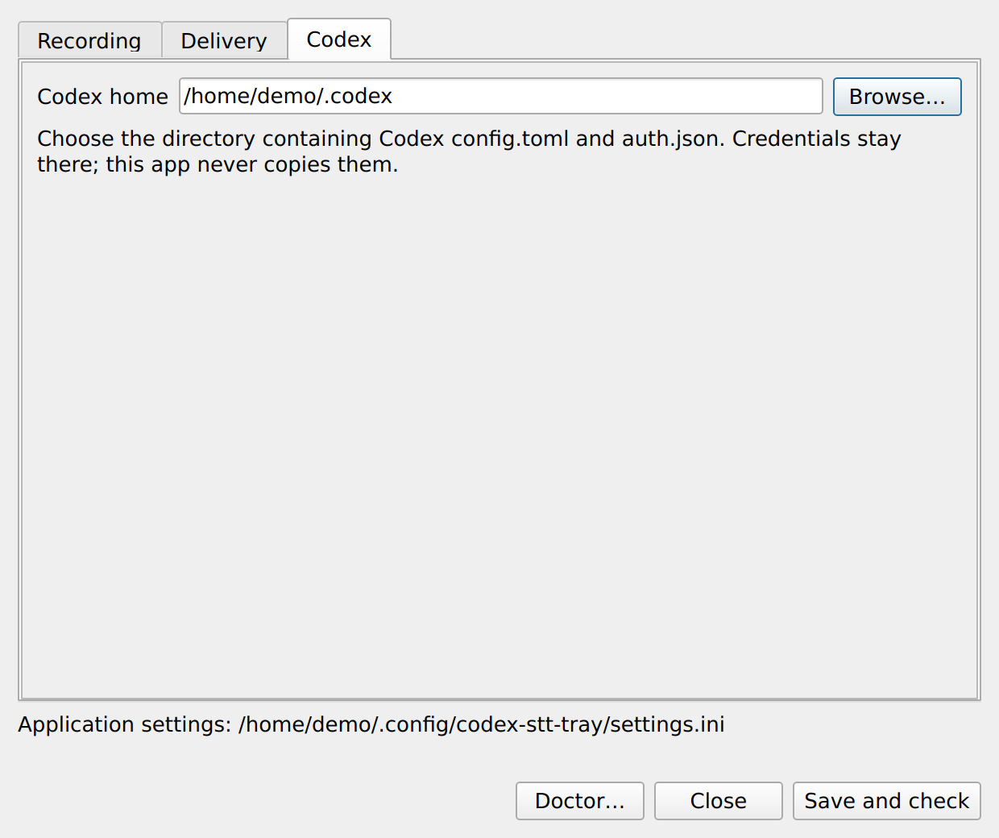
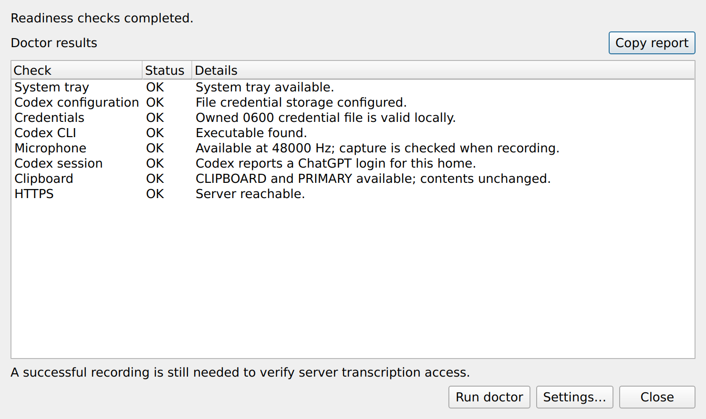
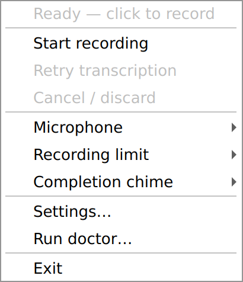

# Codex STT Tray

A small Python 3.13+ / PySide6 application for dictation on KDE Plasma.
Click the red tray icon to record; click again to transcribe. The final text
is copied to the clipboard, followed by a green check and a quiet chime.

## Install and run

**Requires Linux with a system tray and microphone, [uv](https://docs.astral.sh/uv/getting-started/installation/),
Git, and [Codex CLI](https://learn.chatgpt.com/docs/codex/cli).**
KDE Plasma on X11 is the primary target. The app uses Python 3.13+; uv can install
Python for you. Automatic paste and recording shortcuts currently require X11.

### 1. Install the tray application

```sh
git clone https://github.com/emsi/codex-stt-tray.git
cd codex-stt-tray
uv tool install --python 3.13 .
```

This installs the `codex-stt-tray` command in uv's tool environment; you do not
need to activate a virtual environment. If the command is not on your `PATH`,
run `uv tool update-shell` and open a new terminal.
See [uv's tool installation guide](https://docs.astral.sh/uv/guides/tools/).

### 2. Set up your Codex login

**This app needs a ChatGPT login stored in a Codex credential file.**
Keyring-only credentials and OpenAI Platform API keys are not supported by this app.

In your Codex `config.toml` (normally `~/.codex/config.toml`), add or update this
**top-level** setting, before any `[section]` headers. Preserve your other settings:

```toml
cli_auth_credentials_store = "file"
```

Then sign in through the browser and check the login:

```sh
codex login
codex login status
```

Choose your ChatGPT account. If you previously used keyring storage, sign in again
after setting file storage. The app requires `auth.json` to be owned by your user
and readable/writable only by you (`0600`). If Doctor reports a permission issue:

```sh
chmod 600 "${CODEX_HOME:-$HOME/.codex}/auth.json"
```

Codex manages the credentials; the tray app never creates, copies, or edits them.
See [OpenAI's Codex authentication documentation](https://learn.chatgpt.com/docs/auth).

Using a different Codex home? Configure `config.toml` in that directory and run
`CODEX_HOME=/path/to/codex-home codex login`. Select the same directory under
**Settings → Codex → Codex home** in the tray app. The saved selection overrides
`CODEX_HOME`; clearing the field restores the environment/default behavior.
`CODEX_CLI_PATH` can point to a Codex executable outside your desktop's `PATH`.

### 3. Launch and record

```sh
codex-stt-tray
```

Doctor runs automatically on startup. Right-click the tray icon to open
**Settings…** or **Run doctor…**. Click the red icon to start recording, then
click again to stop and transcribe. A green check and quiet chime signal that
copying succeeded. Closing Settings or Doctor leaves the tray running.

Configure the microphone and optional start/stop shortcut under **Recording**.
Under **Delivery**, choose CLIPBOARD, PRIMARY, or both, and optionally enable
keyboard or middle-click paste. Automatic paste and a recording shortcut are
both disabled until you configure them.

This uses an **internal, unsupported** Codex Desktop endpoint. Access and
compatibility are not guaranteed. There is no Platform API-key or local-model
fallback. See [the contract](docs/compatibility.md).

[Application screenshots](#screenshots) · [Desktop behavior](#desktop-behavior) ·
[Updating and autostart](#updating-and-optional-autostart) · [Development](#development)

## Screenshots

Actual application widgets, rendered with Qt's Fusion style and **example X11
preferences and Doctor results**. Your desktop theme may differ. These examples
show automatic paste and a recording shortcut enabled; both are off by default.
Click a screenshot to see it at full size.

| Recording settings | Clipboard and paste settings |
| --- | --- |
| [](docs/screenshots/settings-recording.png) | [](docs/screenshots/settings-delivery.png) |

| Codex home selection | Separate Doctor window |
| --- | --- |
| [](docs/screenshots/settings-codex.png) | [](docs/screenshots/doctor.png) |

The tray menu provides recording controls, quick settings, Doctor, and Exit:

[](docs/screenshots/tray-menu.png)

## Desktop behavior

- Static red circle: ready. Pulsing red stop icon: recording.
- Amber animation: uploading/transcribing/copying. Green check: copied.
- Warning icon: failure; use the context menu to retry or discard.
- Right-click: start/stop, cancel, retry, **Settings…**, **Run doctor…**, **Exit**.
- Settings has compact **Recording**, **Delivery**, and **Codex** tabs.
  **Doctor** is a separate window with readiness results, **Copy report**, and
  a button to open Settings. Closing either window keeps the tray running.
- **Delivery → Copy transcript to** selects **CLIPBOARD**, **PRIMARY**, or both.
  The default remains CLIPBOARD, preserving existing installations. PRIMARY is
  the X11 mouse selection: replacing it affects subsequent middle-click pastes.
  The app writes only the selected destinations; Klipper's synchronization settings
  can independently mirror them. PRIMARY publication currently requires X11;
  unsupported selections are reported before any copy is attempted.
- Optional automatic paste is disabled by default and supports X11. Choose
  **Keyboard shortcut** (Ctrl+V, Ctrl+Shift+V, or Shift+Insert) or **Middle mouse
  click (PRIMARY)**. Existing keyboard preferences are preserved. Keyboard paste
  uses the application focused when transcription finishes; its configured shortcut
  must read a selected destination. Konsole's default Ctrl+Shift+V and Shift+Insert
  both read CLIPBOARD. The tray cannot determine an application's custom bindings.
- Middle-click requires copying to PRIMARY (alone or with CLIPBOARD). Place the
  pointer over the intended text area in the focused application before transcription
  finishes. The app does not move the pointer or change focus. It skips the click
  if the pointer is outside that client's bounds, on window decorations, or moves
  while waiting. Applications may intercept middle-click or configure it to use
  another selection; the app requests a click, not confirmed text insertion.
- Both paste methods wait up to two seconds for held keys and mouse buttons to
  be released. Changes to focus or the published selections cancel the pending
  paste. A failed paste is not retried automatically; successful copying remains
  independent of paste activation.
- Set **Start / stop shortcut** in Settings to register one global X11 key
  combination. Clear it to disable. The same combination starts and stops;
  key repeats and activations while processing are ignored. Conflicts leave the
  previous shortcut active and are reported in Settings. No shortcut is assigned
  by default. Wayland global shortcuts are not implemented in this version.
- Silence trimming is enabled by default and affects only the start and end.
  It uses a conservative −55 dBFS RMS threshold with 300 ms padding, retaining
  edge silence shorter than 500 ms and every pause between speech passages.
  Disable it or adjust threshold/padding in Settings; lower thresholds preserve
  quieter speech. Background noise may deliberately remain untrimmed. If every
  frame falls below the threshold, the app reports **No speech detected** locally
  and does not upload. This is an energy detector, not a speech recognition model.
- The tray also offers quick microphone and chime choices, and recording-limit
  presets of **3, 5, or 10 minutes**. **Custom…** opens Settings for any value
  from **1 to 3,000 seconds** (50 minutes). Quick choices persist immediately;
  changing the microphone reruns doctor. The default remains five minutes.
- Closing Settings, finishing a recording, or encountering an error keeps the
  tray running. Exit explicitly from the menu (or send SIGINT/SIGTERM).
- One recording at a time; maximum 50 minutes. Capture uses mono 16-bit PCM
  at up to 48 kHz, with a bounded audio payload of approximately 275 MiB.
  WAV finalization and upload can temporarily require additional memory.
- Audio stays in bounded memory. No recording or transcript files are written.
- On retryable failure, the pending audio or transcript is kept in memory for
  up to five minutes, or until discarded, replaced, or the app exits.
- Selected copy destinations are replaced only after successful transcription.
  If publication to both partially fails, the app reports a retryable copy error
  and does not attempt automatic paste; the successful write is not rolled back.
  Clipboard managers such as Klipper may save copied text in their history.
- KDE Wayland requires the Clipboard applet (Klipper). Its native D-Bus API
  publishes the clipboard without opening a window or running a clipboard CLI.
  X11 uses Qt's clipboard directly.
- Cancel aborts an active upload but cannot retract audio already sent. A
  clipboard request already delivered to Klipper cannot be recalled.
- Completion uses an icon and the app's chime; no transcript is put in a
  desktop notification. Sound failure does not invalidate a successful copy.

Preferences live in `~/.config/codex-stt-tray/settings.ini`, or
`$XDG_CONFIG_HOME/codex-stt-tray/settings.ini` when configured. This dedicated
directory contains application preferences, never copied Codex credentials.

Doctor runs on startup, after **Save and check**, and on request. It checks
configuration, credential-file safety, the Codex ChatGPT session, microphone
availability/format, tray, clipboard service, and HTTPS reachability. Errors
open Doctor; its **Settings…** button opens preferences for repair. The app stays
running. Checks are asynchronous where they involve network or child processes,
and have bounded timeouts.
Doctor does not record, overwrite the clipboard, or upload audio: a successful
recording is still needed to verify microphone capture and transcription access.
The HTTPS check reports **Server reachable.** when the server responds, including
HTTP 401/403 from the unauthenticated probe. Authentication is checked separately.
After a real recording is transcribed and copied, doctor marks transcription
as verified for that Codex home during the current app session. This status does
not carry over to a different Codex home or survive an application restart.
Use **Copy report** in Doctor to copy all displayed doctor results as plain
text for pasting into a message or issue. Report copying always uses CLIPBOARD,
independently of the transcript delivery preference.

The only child process is Codex's app-server, used by doctor to check the login
without forcing refresh, and after an HTTP 401 to refresh expired authentication.
Both use the selected Codex home. All HTTP work is asynchronous Qt networking.

## Updating and optional autostart

To update an installation, exit the running tray app, then run from this checkout:

```sh
git pull --ff-only
uv tool install --force --python 3.13 .
codex-stt-tray
```

`packaging/codex-stt-tray.desktop` is a launcher template. Install it in
`~/.local/share/applications/` after setting `Exec` to the absolute installed
executable path if your desktop PATH does not include uv's tool directory.
For opt-in login startup, place the configured launcher in `~/.config/autostart/`.
The app does not enable autostart itself.

## Development

```sh
uv sync --python 3.13
uv run codex-stt-tray
QT_QPA_PLATFORM=offscreen uv run pytest
uv run ruff check .
uv run ruff format --check .
uv build
```

Python is pinned to 3.13 for development; the package requires Python >=3.13.
The lockfile records the dependency versions. PySide6 provides the application framework.
Linux desktop Qt libraries and a working audio server are also required.
python-xlib provides native X11 keyboard integration.

To regenerate the documentation screenshots with isolated example data:

```sh
uv run --frozen python scripts/capture_screenshots.py
```

The capture script uses actual widgets offscreen. It does not read your settings
or credentials, open the microphone, change the desktop clipboard, or run Doctor.
See [screenshot details](docs/screenshots/README.md).

## Validation

**No transcript returned** means the server returned an empty or null transcript
field. **Unexpected server response** means malformed JSON, a missing field, or
an invalid field type/encoding. These failures do not log audio, response bodies,
or transcript contents.

Automated tests use synthetic audio, dummy credentials, fake transports, and
local child processes. They do not read your Codex login or contact the STT
server. Live microphone/desktop/backend validation is a separate manual step:
see [architecture and acceptance checks](docs/architecture.md).

Inspired by [codex-stt-bridge](https://github.com/ai-babai/codex-stt-bridge) and
[codex-voice](https://github.com/anthnykr/codex-voice). This is an independent
implementation, not an official OpenAI application.
